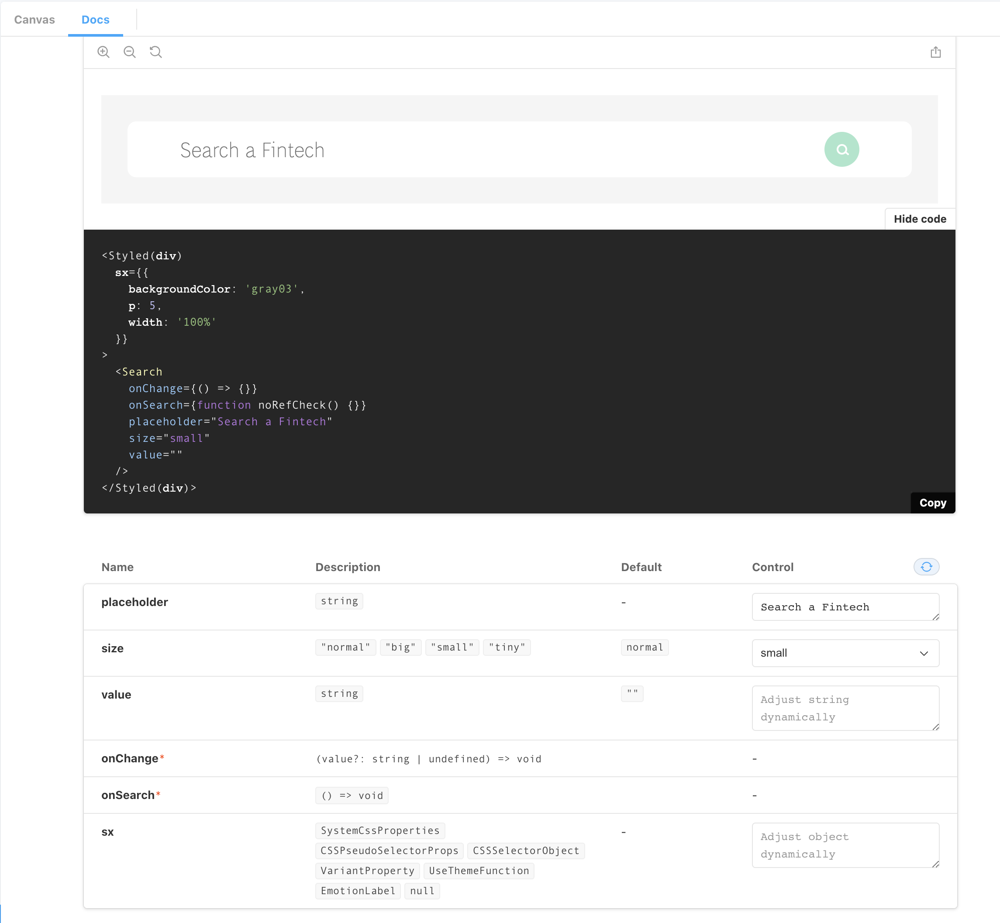
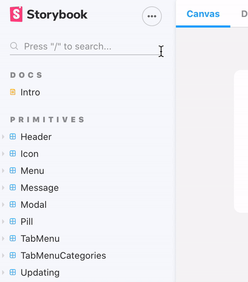

# Front end for Expand Fintech Control Panel

  * [Overview](#overview)
    + [Gitflow](#gitflow)
      - [Git flow rules:](#git-flow-rules-)
  * [Folder structure](#folder-structure)
  * [Development](#development)
      - [`yarn storybook`](#-yarn-storybook-)
      - [`yarn start`](#-yarn-start-)
    + [Create a new component](#create-a-new-component)
      - [`yarn cp NameOfComponent`](#-yarn-cp-nameofcomponent-)
    + [Storybook convention](#storybook-convention)
      - [Storybook documentation](#storybook-documentation)
      - [Storybook component variants / props](#storybook-component-variants---props)
        * [Text Field variants example](#text-field-variants-example)
    + [Theme-ui](#theme-ui)
    + [Routes](#routes)
    + [Mocks](#mocks)
  * [Integration with back-end](#integration-with-back-end)
  * [Testing and Linting](#testing-and-linting)
  * [Deployment](#deployment)

## Overview
This repository contains the front end web application for all UI elements for the Fintech Control Tower.

This app is created using the standard `create-react-app`.

### Gitflow 


#### Git flow rules: 

* Never push directly to `master`
* `develop` is the development branch
* `feature/new-feature` branches should be branched out from `develop`
* whenever a feature branch is complete, create a merge request to `develop`
* whenever `develop` is stable and ready to be released, pump the version on `package.json` and create a merge request to `master`

Read more about [Gitflow Workflow](https://medium.com/@isaacdecoded/git-implementing-gitflow-workflow-b9d0fed494e5)

## Folder structure

```
docs/
public/
src/
    components      // components
    pages           // pages
    hooks           // custom React hooks
    strings         // locale strings
    types           // TS types
    utils           // common utilities
    theme           // theme file for Theme.ui
```

The rule of thumb is that `pages` hold the state of all components and all components are stateless managed by the `page` component it's in.

## Development

The best way to see what's going on with the Front-end is to peak at the Storybook components preview

#### `yarn storybook`

Starts Storybook preview for all components

#### `yarn start`

Starts local development server

### Create a new component 

#### `yarn cp NameOfComponent`

This will create a new component using the default parameters and folder structure that can be found on `.crfc` the component will have the following structure 

```
src/components/NameOfComponent
    index.ts
    NameOfComponent.tsx
    NameOfComponent.test.tsx
    NameOfComponent.stories.tsx
```

When creating a new component, don't forget to export it again from `src/components/index.ts` to keep it indexed inside the `components` namespace.

### Storybook convention

We have followed the Atomic design pattern going from the smallest piece of component to a bigger component with basic business logic to it.

We currently have the following types 

```
• Primitives
• Buttons
• Form Elements
• Widgets
• Search
• Taxonomy
• Company Details
```

Use the namespaces above when setting the `title` property inside your new `NameOfComponent.stories.tsx`. See `src/components/TextField.stories.tsx` for reference. It should look like 

```
{title: '[ConventionType]/NameOfComponent'}
```

#### Storybook documentation

Every component has its Canvas mode and Docs mode. Make sure you check the `Docs` tab when implementing any component to check its props and events. 

Example




#### Storybook component variants / props

Some components have pre-set variants that can be seen using the inspector on the bottom. If yon can't see the inspector, click on the `...` button next to Storybook title to enable `Show addons` or press `A` on  your keyboard.



##### Text Field variants example


### Theme-ui

Theme-ui is the framework of choice to handle the components. Theme-ui uses CSS-in-JS and can be found at `theme/index.ts`.

Theme-ui is very powerful to handle responsive layouts, [check their documentation](https://theme-ui.com/getting-started) to learn more.

### Routes

Routes are found inside `types/enums.ts`, we are using `react-router-dom` to handle routing

### Mocks

We currently have a mock for all components so we can test them individually inside Storybook. All mocks are inside `src/__mock__` folder.

## Integration with back-end

The integration happens at the `Page` level. The pages that are connected to the backend have a `graphql` folder with the following structure 

```
src/pages/Company/
    graphql/
        query-name.ts
        mutation-name.ts
        index.ts
```

And are invoked using `apollo/client` hooks `useQuery` and `useMutation` as follwing:

```js
import { createCompanyMutation, getInternalCompany } from './graphql'

const { loading: queryLoading, error: queryError, data: queryData } = useQuery(
    getInternalCompany {
      variables: { id } },
    }
  )

const [addCompany, { loading: mutationLoading }] = useMutation(createCompanyMutation)
```

For mutations you have to call the created reference for it like the following 

```js
const onPressAdd = async () => {
try {
    const result = await addCompany({
    variables: { input: [{ externalId: id, source: getSource(source) }] },
    })

    if (result.data.createCompany) {
    setState({ ...state, modalVisible: 'successAdd' })
    } else {
    setError({ message: strings.error.default })
    }
} catch (e) {
    setError(e)
}
}
```

## Testing and Linting

We generate Test snapshots on very commit and those are pushed to the repository to be tested against when there's a new push. Since we're using Typescript, Snapshots are enough for us to check whether components are receiving the right properties.

We use `prettier` as the code standard, check `.prettierrc` for more details.

Linting, tests and Typescript checks are run on `pre-commit` by `Husky` 

## Deployment

The app is hosted within a static S3 bucket with a cloudfront distribution. All commits to the master branch will trigger the automatic deployment of a built version of the app to the test environment.